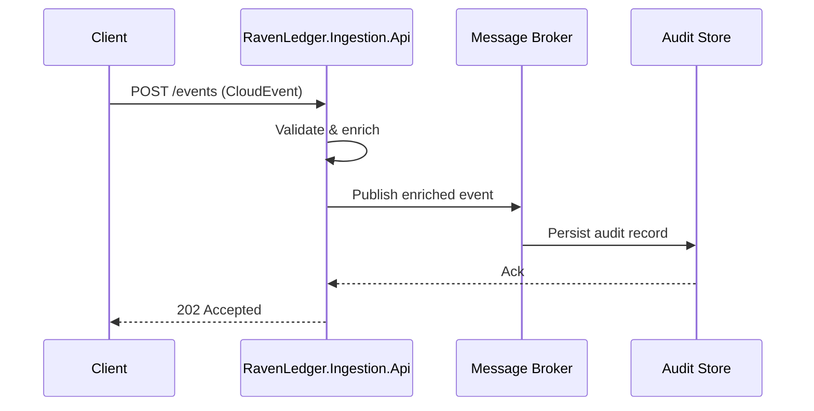

# Diagram Generation — Mermaid (GitHub-compatible)

All diagrams in this repository **must** be written in [Mermaid](https://mermaid.js.org/) syntax, embedded in fenced code blocks with the `mermaid` language tag. This ensures they render natively in GitHub Markdown (`.md` files, PRs, Issues, and Wiki pages) without any external tooling.

## Fenced block format

````markdown
```mermaid
<diagram content here>
```
````

Never use image links, PlantUML, draw.io exports, or any other format.

---

## Diagram type selection guide

Choose the most appropriate diagram type for the context:

| Context | Mermaid type |
|---|---|
| Component or microservice topology | `graph TD` / `graph LR` |
| Request/response interactions between services | `sequenceDiagram` |
| Domain entities and their relationships | `erDiagram` |
| State machine or lifecycle | `stateDiagram-v2` |
| Deployment or container layout | `graph TD` with subgraphs |
| CI/CD pipeline | `flowchart LR` |
| Class hierarchy | `classDiagram` |

---

## Conventions for this project

- **Direction**: prefer `TD` (top-down) for architecture overviews; `LR` (left-right) for pipelines and flows.
- **Node labels**: use the real component name (e.g., `RavenLedger.Ingestion.Api`, `Kafka`, `PostgreSQL`). Avoid generic labels like `Service A`.
- **Edge labels**: always label edges when the relationship is not self-evident (e.g., `-->|CloudEvent|`, `-->|audit record|`).
- **Subgraphs**: group nodes by bounded context, infrastructure layer, or deployment boundary.
- **Style**: do not add `style` or `classDef` directives unless color-coding adds essential meaning (GitHub's default Mermaid theme is sufficient).
- **Consistency**: diagrams that describe the same system at different levels of detail must use the same node IDs and labels so diffs are readable.

---

## Example — ingestion flow



---

## Placement of diagrams in documentation

- Architecture overviews → `.docs/` directory alongside their explanation file.
- Spec-level flows → inside the relevant `.specs/` spec file, immediately after the section they describe.
- README top-level architecture → `README.md` under a dedicated `## Architecture` section.
- Never embed diagrams inside source code comments.

---

## Validation checklist before saving a diagram

- [ ] Fenced block uses ` ```mermaid ` (not ` ```mmd ` or similar).
- [ ] Diagram renders without syntax errors (paste into <https://mermaid.live> to verify).
- [ ] All node labels match the real component names used in the codebase.
- [ ] Edge labels are present where the relationship type matters.
- [ ] Diagram is placed in the correct location per the placement rules above.
