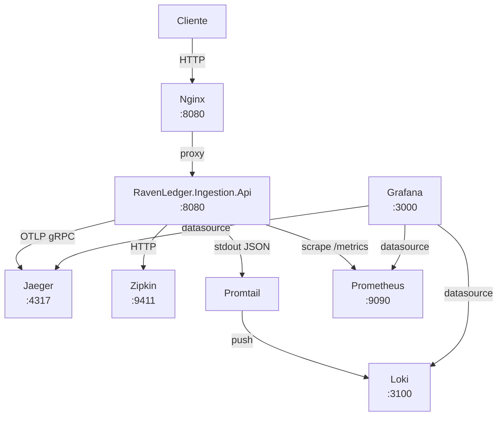

# RavenLedger — Ingestion API

Microserviço de ingestão de eventos de auditoria do [RavenLedger](https://github.com/blogdoft/BlogDoFT.RavenLedger). Recebe eventos via HTTP no formato [CloudEvents 1.0](https://cloudevents.io/), valida o contrato e os encadeia em registros à prova de adulteração.

> Série técnica documentada em português no [Blog do FT](https://github.com/blogdoft).

---

## Pré-requisitos

| Ferramenta | Versão mínima |
|------------|--------------|
| .NET SDK   | 9.0          |
| Docker     | 24+          |
| Docker Compose | v2       |

---

## Estrutura do repositório

```
.docs/
  Configuring-Observability.md  ← guia de configuração de logs e APM no Grafana
src/
  RavenLedger.Ingestion.Api/    ← projeto principal (ASP.NET Core 9, minimal API)
__tests__/
  RavenLedger.Ingestion.Api.Tests/  ← testes unitários (MSTest)
eng/
  docker/
    Dockerfile                  ← build multi-stage (sdk:9.0 → aspnet:9.0)
    docker-compose.yml          ← stack completa de desenvolvimento
    nginx.conf                  ← proxy reverso
    prometheus.yml              ← configuração de scrape
    promtail-config.yml         ← coleta de logs Docker → Loki
    grafana-datasources.yml     ← provisioning do Grafana (Prometheus, Loki, Jaeger)
```

---

## Rodando localmente (sem Docker)

```bash
dotnet build
dotnet test
dotnet run --project src/RavenLedger.Ingestion.Api
```

Para rodar um teste específico:

```bash
dotnet test --filter "FullyQualifiedName~NomeDoTeste"
```

---

## Rodando a stack completa com Docker

A partir da raiz do repositório:

```bash
docker compose -f eng/docker/docker-compose.yml up --build
```

A API fica acessível via proxy reverso Nginx em `http://localhost:8080`.

Para derrubar a stack:

```bash
docker compose -f eng/docker/docker-compose.yml down
```

---

## Ferramentas de observabilidade

A stack de desenvolvimento inclui coleta distribuída de traces, métricas, logs e visualização. Todos os serviços ficam na rede Docker interna `observability`.

> Guia detalhado de configuração: [.docs/Configuring-Observability.md](.docs/Configuring-Observability.md)

### Diagrama de relacionamento



| Serviço        | Protocolo recebido         | Finalidade                          |
|----------------|----------------------------|-------------------------------------|
| **Jaeger**     | OTLP gRPC (4317)           | Rastreamento distribuído (APM)      |
| **Zipkin**     | HTTP Zipkin (9411)         | Rastreamento distribuído            |
| **Prometheus** | Scrape HTTP (/metrics)     | Coleta de métricas                  |
| **Loki**       | HTTP push (Promtail)       | Agregação de logs                   |
| **Promtail**   | Docker socket              | Coleta e envio de logs ao Loki      |
| **Grafana**    | —                          | Dashboards (Prometheus, Loki, Jaeger) |
| **Nginx**      | HTTP (80→8080)             | Proxy reverso para a API            |

### URLs de acesso

| Interface        | URL                         | Credenciais         |
|------------------|-----------------------------|---------------------|
| API              | http://localhost:8080       | —                   |
| Jaeger UI        | http://localhost:16686      | —                   |
| Zipkin UI        | http://localhost:9411       | —                   |
| Prometheus       | http://localhost:9090       | —                   |
| Grafana          | http://localhost:3000       | admin / admin       |
| Loki (API)       | http://localhost:3100       | —                   |

---

## Configuração de observabilidade

Os exporters são controlados por `appsettings.json` (desligados por padrão) e ativados em `appsettings.Development.json` quando a stack Docker está rodando.

```json
// appsettings.json — valores padrão (todos desligados)
"Observability": {
  "Otlp":       { "Enabled": false, "Endpoint": "http://localhost:4317" },
  "Zipkin":     { "Enabled": false, "Endpoint": "http://localhost:9411/api/v2/spans" },
  "Prometheus": { "Enabled": false, "ScrapeEndpointPath": "/metrics" }
}
```

```json
// appsettings.Development.json — ativo quando rodando via Docker Compose
"Observability": {
  "Otlp":       { "Enabled": true, "Endpoint": "http://jaeger:4317" },
  "Zipkin":     { "Enabled": true, "Endpoint": "http://zipkin:9411/api/v2/spans" },
  "Prometheus": { "Enabled": true, "ScrapeEndpointPath": "/metrics" }
}
```

Para rodar a aplicação fora do Docker apontando para a stack local, sobrescreva via variável de ambiente:

```bash
Observability__Otlp__Enabled=true \
Observability__Otlp__Endpoint=http://localhost:4317 \
dotnet run --project src/RavenLedger.Ingestion.Api
```

---

## Logging

Logs são emitidos em formato JSON via Serilog no stdout, usando `ExpressionTemplate` com o template:

```
{ {date: @t, level: @l, message: @m, exception: @x, ..@p} }
```

Cada linha de log é um objeto JSON com os campos `date`, `level`, `message`, `exception` e todas as propriedades structured da mensagem (spread via `..@p`). A configuração completa fica no `appsettings.json` sob a chave `Serilog`.

Ao iniciar, a aplicação emite:

- `Information` — versão e timestamp UTC de início
- `Warning` — versão e timestamp UTC de encerramento
